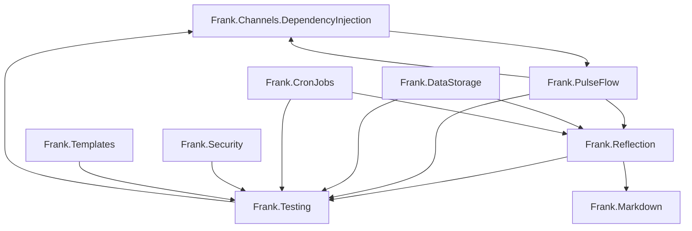

# Frank.\* repository inventory

Master inventory for migrating legacy [frankhaugen](https://github.com/frankhaugen) libraries into [Novolis-Platform](https://github.com/Novolis-Platform).

- **Assessed:** 2026-05-17 (shallow clone + metadata; SDK **10.0.203** / **net10.0** on sampled repos)
- **Naming:** [frank-naming-and-structure.md](frank-naming-and-structure.md) — package/folder/namespace sign-off
- **Gate:** [bootstrap-gate-assessment.md](bootstrap-gate-assessment.md) — org bootstrap done; migration publish gate on `novolis-messaging`
- **Runbook:** [frank-migration-runbook.md](frank-migration-runbook.md)
- **Policy:** Extract/rebuild into `novolis-*`; no default history transfer
- **Game:** [gameengine-reference-policy.md](gameengine-reference-policy.md) — `novolis-raylib` first

## Dependency graph (Frank → Frank)

**Wave implication:** `novolis-messaging` (Channels) → `novolis-testing` early → then transports/storage/security.

## Summary by tier

| Tier | Count | Action |
|------|-------|--------|
| P0 | 7 | Extract into reserved Novolis repos (see waves) |
| P1 | 8 | Spike complete — conditional extract (see [frank-p1-spikes.md](frank-p1-spikes.md)) |
| P2 | 6 | Reference / decompose / rebuild ideas only |
| P3 | 3+ | Skip or archive |

## P0 — Bring (validated 2026-05-17)

| Repo | S/D/M | Total | Novolis repo | Novolis packages | Mode | Release | Tests | Frank deps | Notes |
|------|-------|-------|--------------|------------------|------|---------|-------|------------|-------|
| [Frank.Channels.DependencyInjection](https://github.com/frankhaugen/Frank.Channels.DependencyInjection) | 5/5/5 | **15** | `novolis-messaging` | `Novolis.Messaging.Channels` | Extract | 2.2 | 2 facts | `Frank.Testing.TestBases` (tests only) | **Pilot** — 1 packable project |
| [Frank.PulseFlow](https://github.com/frankhaugen/Frank.PulseFlow) | 5/4/5 | **14** | `novolis-messaging` | `Novolis.Messaging` | Extract | 3.0 | 8 facts | Channels, Reflection, Testing | docs/; after Channels |
| [Frank.BedrockSlim](https://github.com/frankhaugen/Frank.BedrockSlim) | 5/4/4 | **13** | `novolis-transports` | `Novolis.Transports.Tcp.Server`, `.Client` | Extract | 1.1 | 1 fact | Cryptography (internal) | Skip Cryptography unless needed |
| [Frank.Testing](https://github.com/frankhaugen/Frank.Testing) | 5/4/4 | **13** | `novolis-testing` | `Novolis.Testing.TUnit`, `.Logging`, `.Testcontainers`, `.TestBases`, `.TestServer` | Extract | 2.0 | sparse | Reflection | Wave 1 — unblocks all migrations |
| [Frank.DataStorage](https://github.com/frankhaugen/Frank.DataStorage) | 4/4/4 | **12** | `novolis-storage` | **Wave 3 subset:** `.Json`, `.Sqlite` + `Abstractions` | Extract subset | 3.1 | 6 facts | Reflection, Testing | 10 packable backends — do not migrate all at once |
| [Frank.Http](https://github.com/frankhaugen/Frank.Http) | 4/4/4 | **12** | `novolis-transports` | `Novolis.Transports.Http` (+ abstractions/auth/extensions) | Extract | 1.1 | 0 facts | none | Add tests during migration |
| [Frank.Security](https://github.com/frankhaugen/Frank.Security) | 4/4/3 | **11** | `novolis-security` | `Novolis.Security.Secrets`, `.PasswordHashing`, `.Encryption`, `.HaveIBeenPwned`; `WordLists` internal | Extract | 0.2 | 8 facts | Testing | Word lists in `Novolis.Security.WordLists` |

## P1 — Evaluate (spike complete)

| Repo | S/D/M | Total | Novolis target | Spike verdict | Mode |
|------|-------|-------|----------------|---------------|------|
| [Frank.CronJobs](https://github.com/frankhaugen/Frank.CronJobs) | 4/4/3 | 11 | TBD (`Novolis.Scheduling`?) | **Conditional** — 2 packages (`Frank.CronJobs`, `.Cron`); depends Reflection+Testing; 0 facts in quick scan — rebuild with tests | Extract after Testing |
| [Frank.Reflection](https://github.com/frankhaugen/Frank.Reflection) | 4/4/4 | 12 | `novolis-codegen` | **Partial** — bring `Reflection`, `Dump`, `Mermaid`; defer Roslyn stack until needed | Extract subset |
| [Frank.Analyzers](https://github.com/frankhaugen/Frank.Analyzers) | 4/3/4 | 11 | `novolis-analyzers`, `novolis-codegen` | **Partial** — `AutoMapper`, `CodeLength` analyzers; skip CppInteropts unless native lane | Extract subset |
| [Frank.Templates](https://github.com/frankhaugen/Frank.Templates) | 4/3/4 | 11 | `novolis-templates` | **Merge** — align with `novolis-template-dotnet`; drop duplicate NuGetSolution template | Merge |
| [Frank.Mermaid](https://github.com/frankhaugen/Frank.Mermaid) | 3/3/3 | 9 | `novolis-markup` | **Wave 10** — fluent diagram text; archive after ship | Extract |
| [Frank.Markdown](https://github.com/frankhaugen/Frank.Markdown) | 3/3/4 | 10 | `novolis-markup` | **Wave 10** — 38 facts, fluent API | Extract |
| [Frank.WireFish](https://github.com/frankhaugen/Frank.WireFish) | 3/3/3 | 9 | `novolis-transports` | **Migrated** — `Novolis.Transports.WireFish`; depends on Messaging.Channels | Extract (wave 9) |
| [Frank.Networking](https://github.com/frankhaugen/Frank.Networking) | 3/3/3 | 9 | `novolis-transports` | **Defer** — no NuGet releases; audit overlap with Bedrock/Http first | Partial later |
| [Frank.Collections](https://github.com/frankhaugen/Frank.Collections) | 3/3/3 | 9 | `novolis-math`? | **Defer** — `Array2D`, `ObservableList`; 27 facts; low strategic fit | Extract if demanded |
| [Frank.ML](https://github.com/frankhaugen/Frank.ML) | 2/2/2 | 6 | `novolis-machinelearning` | **Partial** — neural foundation only (wave 8); AutoML/apps stay private | Extract subset |

## P2 — Reference / archive

| Repo | Total | Treatment |
|------|-------|-----------|
| [Frank.GameEngine](https://github.com/frankhaugen/Frank.GameEngine) | — | [gameengine-reference-policy.md](gameengine-reference-policy.md) — selective mining (wave 7 math); repo stays active |
| [Frank.Libraries](https://github.com/frankhaugen/Frank.Libraries) | — | Decompose catalog only; author disclaims production use |
| [Frank.SimpleInstaller](https://github.com/frankhaugen/Frank.SimpleInstaller) | — | Rebuild ideas into `novolis-install` |
| [Frank.IRC](https://github.com/frankhaugen/Frank.IRC) | — | Skip — learning project |
| [Frank.CrossPlatformWindow](https://github.com/frankhaugen/Frank.CrossPlatformWindow) | — | Skip unless native window lane outside Raylib |
| [Frank.Libraries.Wpf](https://github.com/frankhaugen/Frank.Libraries.Wpf) | — | Skip — WPF off-brand |

## P3 — Skip

| Repo | Reason |
|------|--------|
| Frank.IRC | Educational; overlaps Networking.Irc |
| Frank.ML (apps/domain) | Apps and domain code remain on private Frank.ML |
| Frank.Libraries.Wpf / CrossPlatformWindow | No Novolis lane |

## Frank → Novolis package mapping

| Frank package | Novolis package | Target repo |
|---------------|-----------------|-------------|
| `Frank.Channels.DependencyInjection` | `Novolis.Messaging.Channels` | `novolis-messaging` |
| `Frank.PulseFlow` | `Novolis.Messaging` | `novolis-messaging` |
| `Frank.BedrockSlim.Server` / `.Client` | `Novolis.Transports.Tcp.Server` / `.Client` | `novolis-transports` |
| `Frank.Http` (+ abstractions) | `Novolis.Transports.Http` (+ facets) | `novolis-transports` |
| `Frank.Testing.*` | `Novolis.Testing.*` | `novolis-testing` |
| `Frank.DataStorage.Json` / `.Sqlite` | `Novolis.Storage.Json` / `.Sqlite` | `novolis-storage` |
| `Frank.Security.Cryptography` / `.HaveIBeenPwned` | `Novolis.Security.Secrets`, `.PasswordHashing`, `.Encryption`, `.HaveIBeenPwned` | `novolis-security` |
| `Frank.CronJobs` | `Novolis.Scheduling` (TBD) | TBD |
| `Frank.Reflection` (subset) | `Novolis.CodeGen.*` | `novolis-codegen` |
| `Frank.Analyzers.*` (subset) | `Novolis.Analyzers.*` | `novolis-analyzers` |
| `Frank.GameEngine.Primitives` (subset) | `Novolis.Math.Arrays`, `Novolis.Math.Geometry` | `novolis-math` |
| `Frank.ML.Foundation.Neural.*` | `Novolis.MachineLearning.Neural.*` | `novolis-machinelearning` |
| `Frank.WireFish` | `Novolis.Transports.WireFish` | `novolis-transports` |
| `Frank.Markdown` | `Novolis.Markup.Markdown` | `novolis-markup` |
| `Frank.Mermaid` | `Novolis.Markup.Mermaid` | `novolis-markup` |
| `Frank.GameEngine.*` (remainder) | *none* | see game policy |

## Extraction waves

| Wave | Novolis repo | Frank sources | Brief |
|------|--------------|---------------|-------|
| 0 | `novolis-messaging` | Channels.DI → PulseFlow | [extraction-briefs/wave-0-messaging.md](extraction-briefs/wave-0-messaging.md) |
| 1 | `novolis-testing` | Frank.Testing | [extraction-briefs/wave-1-testing.md](extraction-briefs/wave-1-testing.md) |
| 2 | `novolis-transports` | BedrockSlim, Http | [extraction-briefs/wave-2-transports.md](extraction-briefs/wave-2-transports.md) |
| 3 | `novolis-storage` | DataStorage subset | [extraction-briefs/wave-3-storage.md](extraction-briefs/wave-3-storage.md) |
| 4 | `novolis-security` | Frank.Security | [extraction-briefs/wave-4-security.md](extraction-briefs/wave-4-security.md) |
| 5 | `novolis-analyzers` / `novolis-codegen` | Analyzers, Reflection subset | [wave-5-codegen.md](extraction-briefs/wave-5-codegen.md), [wave-5-analyzers.md](extraction-briefs/wave-5-analyzers.md) |
| 6 | `novolis-templates` | Frank.Templates | [wave-6-templates.md](extraction-briefs/wave-6-templates.md) |
| 7 | `novolis-math` | GameEngine Primitives subset | [wave-7-gameengine-math.md](extraction-briefs/wave-7-gameengine-math.md) |
| 8 | `novolis-machinelearning` | Frank.ML neural foundation | [wave-8-machinelearning-neural.md](extraction-briefs/wave-8-machinelearning-neural.md) |
| 9 | `novolis-wirefish` | Frank.WireFish | [wave-9-wirefish.md](extraction-briefs/wave-9-wirefish.md) |
| 10 | `novolis-markup` | Frank.Markdown, Frank.Mermaid | [wave-10-markup.md](extraction-briefs/wave-10-markup.md) |
| — | `novolis-install` | SimpleInstaller ideas | Rebuild only |

**Pilot:** [extraction-briefs/pilot-channels.md](extraction-briefs/pilot-channels.md)

## Non-goals

- Bulk migrate [Frank.Libraries](https://github.com/frankhaugen/Frank.Libraries) monolith
- Migrate `Frank.GameEngine.Rendering.*` while `Novolis.Raylib` is active
- Migrate Markdown/Mermaid outside `novolis-markup` (wave 10)
- Transfer git history by default
- Publish production Novolis packages before bootstrap gate opens

## Tracking issues

| Novolis repo | Issue |
|--------------|-------|
| `novolis-messaging` | [#1 pilot Channels](https://github.com/Novolis-Platform/novolis-messaging/issues/1), [#2 PulseFlow](https://github.com/Novolis-Platform/novolis-messaging/issues/2) |
| `novolis-testing` | [#1 Testing wave 1](https://github.com/Novolis-Platform/novolis-testing/issues/1) |
| `novolis-transports` | [#1 TCP + HTTP wave 2](https://github.com/Novolis-Platform/novolis-transports/issues/1) |
| `novolis-storage` | [#1 Storage wave 3](https://github.com/Novolis-Platform/novolis-storage/issues/1) |
| `novolis-security` | [#1 Security wave 4](https://github.com/Novolis-Platform/novolis-security/issues/1) |
| `novolis-physics` | [#1 GameEngine policy](https://github.com/Novolis-Platform/novolis-physics/issues/1) |
