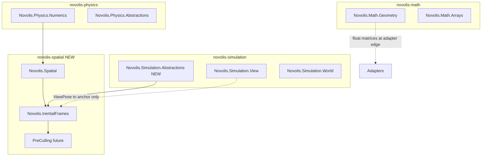

# Novolis Inertial Frame Stack — adapted specification

Maps the **Inertial Frame Stack (IFS)** to current Novolis repos, NuGet packages, and types. Use this when introducing `novolis-spatial` and the first IFS implementation.

**Status:** specification (no `novolis-spatial` repo yet).  
**Related:** [simulation-layer-policy.md](simulation-layer-policy.md), [naming.md](naming.md).

---

## Purpose

**Inertial Frame Stack** is the spatial locality layer.

It defines **where** a simulation frame is evaluated from, and provides coordinate projection to express relevant world-space state in a local, origin-stable frame.

It does not decide what participates, simulate physics, render, or replicate network state.

```text
IFS           = where
PreCulling    = what        (future: Novolis.Spatial.PreCulling)
FrameScene    = prepared work (future: Novolis.Spatial.FrameScene)
Adapters      = execution   (render / physics / net hosts)
```

---

## Placement in the Novolis stack



| Layer | Owns IFS concern? |
|-------|-------------------|
| **Math** | Float meshes, `Camera`, `Transform`, view/projection matrices — **not** world snapshots or frames |
| **Physics.Numerics** | `Vector3d`, `Quaterniond`, `AxisAlignedBox3d` — frame-space numerics |
| **Physics (domains)** | Integration, forces, collision — **must not** build inertial frames |
| **Simulation** | Worlds, kinematics, view controllers — **may consume** `FrameContext`; **does not** own projection |
| **Spatial (new)** | World-space types, IFS, pre-cull pipeline |
| **Raylib / apps** | Draw and product rules — consume prepared local work via adapters |

`Novolis.Simulation.View.ViewPose` is an **observer convenience** (float `Vector3` + yaw/pitch). It is **not** `FrameContext`. Hosts may convert `ViewPose` → `FrameAnchor.Pose` at a double-precision boundary when building a frame.

---

## Repositories and packages

### Target repo

```text
novolis-spatial
```

Per [naming.md](naming.md): domain repo `novolis-spatial`, packages `Novolis.Spatial.*`.

### Packages (v1)

| Package | Responsibility |
|---------|----------------|
| `Novolis.Spatial` | World-space primitives: `WorldPosition`, `WorldVector`, `WorldPose`, `WorldRegion`, spatial query surface |
| `Novolis.Simulation.Abstractions` | Tick + entity identity + read-only world snapshot contract (thin; lives in `novolis-simulation`) |
| `Novolis.InertialFrames` | IFS: `InertialFrame`, `FrameContext`, projection, bands, builders |

Future (same repo, not v1):

| Package | Responsibility |
|---------|----------------|
| `Novolis.Spatial.PreCulling` | `WorldSnapshot` + `FrameContext` → `PreCullResult` |
| `Novolis.Spatial.FrameScene` | Prepared local packets for adapters |

### Must not depend on

```text
Novolis.Raylib.*
Novolis.Physics.Collision.*
Novolis.Physics.Motion / Gravity / Ballistics / …
Novolis.Messaging.*
Rendering hosts, Stride, Vulkan
Game-specific assemblies (SCR product code, DoomLite3D)
```

`Novolis.InertialFrames` **may** reference:

```text
Novolis.Physics.Numerics     (double 3D algebra only)
Novolis.Spatial
Novolis.Simulation.Abstractions
```

Do **not** reference the aggregate `Novolis.Physics` metapackage or simulation world/kinematics packages (avoids cycles and hidden physics coupling).

---

## Type mapping (spec → Novolis)

| Original spec | Novolis today / v1 choice |
|---------------|---------------------------|
| `Novolis.Mathematics` | **`Novolis.Physics.Numerics`** — `Vector3d`, `Quaterniond` already shipped |
| `Bounds3d` | **`AxisAlignedBox3d`** (`Novolis.Physics.Numerics`) for axis-aligned interest regions |
| `Matrix4x4d` | **Not in platform v1.** `IFrameProjector` uses translation + inverse rotation (same pattern as `RigidBodyState` / `Quaterniond.Rotate` in physics). Float `System.Numerics.Matrix4x4` stays at **adapter** boundary via `Novolis.Math.Geometry.Camera` when rendering. |
| `Distance` | **`Vector3d.LengthSquared()`** / `Length()` — no separate distance type |
| `Novolis.Spatial.Abstractions` | **`Novolis.Spatial`** (single abstractions package; split later only if needed) |
| `Novolis.Simulation.Abstractions` | **New** packable project under `novolis-simulation` |
| `WorldSnapshot`, `EntityId`, … | **New** in `Novolis.Simulation.Abstractions` |
| `Novolis.InertialFrames` | **New** under `novolis-spatial` |

### Precision split (aligned with existing code)

| Space | Types | Home |
|-------|-------|------|
| Authoritative world | `WorldPosition`, `WorldPose`, … | `Novolis.Spatial` (double-backed; large-world safe) |
| Frame-local cache | `FramePosition`, `FramePose`, … | `Novolis.InertialFrames` (uses `Vector3d` / `Quaterniond`) |
| GPU / debug float | `Vector3`, `Quaternion`, `Camera` | `Novolis.Math.Geometry` (adapters only) |

World-space is truth. Frame-space is cache.

---

## Dependencies (concrete)

```text
Novolis.InertialFrames
  → Novolis.Physics.Numerics
  → Novolis.Spatial
  → Novolis.Simulation.Abstractions

Novolis.Spatial
  → Novolis.Physics.Numerics

Novolis.Simulation.Abstractions
  → (none required for v1; optional reference to Novolis.Spatial for WorldPosition on EntityView)
```

If `EntityView` carries positions, prefer `Novolis.Simulation.Abstractions` → `Novolis.Spatial` rather than duplicating coordinates in simulation.

---

## Core responsibility

**Given:**

```text
IWorldSnapshot          (Novolis.Simulation.Abstractions)
FrameAnchor             (entity / pose / position)
FrameBands + interest radius
```

**Produce:**

```text
FrameContext            (Novolis.InertialFrames)
```

`FrameContext` supplies origin, orientation, optional velocity baseline, interest region, distance bands, `IFrameProjector`, and band classification helpers.

---

## Core types

Namespaces shown as intended layout.

### Identifiers and frame state (`Novolis.InertialFrames`)

```csharp
namespace Novolis.InertialFrames;

public readonly record struct InertialFrameId(Guid Value);

public readonly record struct InertialFrame(
    InertialFrameId Id,
    WorldPose Origin,
    WorldVector Velocity);
```

### World-space (`Novolis.Spatial`)

```csharp
namespace Novolis.Spatial;

/// <summary>Authoritative world-space point. v1: wraps <see cref="Novolis.Physics.Numerics.Vector3d"/>; later may add sector/origin metadata.</summary>
public readonly record struct WorldPosition(Vector3d Value);

public readonly record struct WorldVector(Vector3d Value);

public readonly record struct WorldPose(WorldPosition Position, Quaterniond Rotation);

/// <summary>Interest/query region in world space. v1: axis-aligned box.</summary>
public readonly record struct WorldRegion(AxisAlignedBox3d Bounds)
{
    public bool Contains(WorldPosition position) => Bounds.Contains(position.Value);
}
```

`ISpatialQuery` (optional v1): minimal read surface used by builders — e.g. try get pose/position by `EntityId`. Implementations live in simulation or product hosts, not in IFS.

### Frame-space (`Novolis.InertialFrames`)

Uses numerics directly (no duplicate vector types):

```csharp
public readonly record struct FramePosition(Vector3d Value);

public readonly record struct FrameVector(Vector3d Value);

public readonly record struct FramePose(FramePosition Position, Quaterniond Rotation);
```

### Bands

```csharp
public readonly record struct FrameBand(
    string Name,
    double EnterDistance,
    double ExitDistance);

public sealed record FrameBands(
    FrameBand Interactive,
    FrameBand Tactical,
    FrameBand Strategic,
    FrameBand Background)
{
    public static FrameBands Default { get; } = /* governed defaults */;
}
```

### Simulation contracts (`Novolis.Simulation.Abstractions`)

```csharp
namespace Novolis.Simulation.Abstractions;

public readonly record struct SimulationTick(ulong Value);

public readonly record struct EntityId(Guid Value);

public readonly record struct EntityView(
    EntityId Id,
    WorldPosition Position,
    WorldPose? Pose = null);

public interface IWorldSnapshot
{
    SimulationTick Tick { get; }
    bool TryGetEntity(EntityId id, out EntityView view);
}
```

Sealed `WorldSnapshot` record implementations belong in simulation or app layers, not in IFS.

### `FrameContext`

```csharp
public sealed record FrameContext(
    InertialFrame Frame,
    WorldRegion InterestRegion,
    FrameBands Bands,
    SimulationTick Tick,
    IFrameProjector Projector)
{
    public double InterestRadiusSquared { get; init; }

    public FrameBandKind Classify(WorldPosition position)
        => FrameBandClassifier.Default.Classify(this, position);
}
```

---

## Projection API (v1)

No `Matrix4x4d`. Projector holds origin pose and cached inverse orientation.

```csharp
public interface IFrameProjector
{
    FramePosition Project(WorldPosition position);
    WorldPosition Unproject(FramePosition position);

    FrameVector Project(WorldVector vector);
    WorldVector Unproject(FrameVector vector);

    FramePose Project(WorldPose pose);
    WorldPose Unproject(WorldPose pose);

    double DistanceSquaredTo(WorldPosition position);
}
```

Implementation sketch: `Project(position) => origin.Rotation⁻¹ * (position - origin.Position)` using `Quaterniond` from `Novolis.Physics.Numerics` (same inverse-rotate approach as `SemiImplicitEulerRigidBodyIntegrator`).

**v2 optional:** `ToSinglePrecisionTransform()` → `Novolis.Math.Geometry.Transform` for render adapters only.

---

## Frame building API

```csharp
public interface IFrameContextBuilder
{
    FrameContext Build(IWorldSnapshot snapshot, FrameRequest request);
}

public sealed record FrameRequest(
    FrameAnchor Anchor,
    FrameBands Bands,
    double InterestRadius);

public abstract record FrameAnchor
{
    public sealed record Entity(EntityId EntityId) : FrameAnchor;
    public sealed record Pose(WorldPose Pose) : FrameAnchor;
    public sealed record Position(WorldPosition Position) : FrameAnchor;
}
```

Convenience:

```csharp
public static class FrameRequests
{
    public static FrameRequest CenteredOn(EntityId entityId, double interestRadius = 100_000)
        => new(
            Anchor: new FrameAnchor.Entity(entityId),
            Bands: FrameBands.Default,
            InterestRadius: interestRadius);
}
```

### Simple usage

```csharp
var frame = frameBuilder.Build(snapshot, FrameRequests.CenteredOn(playerShipId));
var local = frame.Projector.Project(enemy.Position);
var band = frame.Classify(enemy.Position);
```

---

## Band classification

IFS classifies **distance**, not **participation**.

```csharp
public enum FrameBandKind
{
    Interactive,
    Tactical,
    Strategic,
    Background,
    Outside
}

public interface IFrameBandClassifier
{
    FrameBandKind Classify(FrameContext frame, WorldPosition position);
}
```

Hysteresis: use `EnterDistance` / `ExitDistance` per `FrameBand` (e.g. enter tactical 10 km, exit 12 km). Classifier reads prior band from host state if needed; classifier itself stays pure given that state input.

---

## Relationship to PreCulling (future)

```text
IWorldSnapshot
  → IFrameContextBuilder.Build
      FrameContext
  → IPreCullPipeline.Run
      PreCullResult
  → FrameScene
  → Adapters (Raylib, physics islands, replication)
```

`Novolis.Spatial.PreCulling` depends on `Novolis.InertialFrames` + `Novolis.Simulation.Abstractions`. It must not reference Raylib.

---

## What IFS may / must not do

Unchanged from the conceptual spec:

**May:** resolve origin/orientation, interest region, bands, project/unproject, distance classification.

**Must not:** select renderables, physics bodies, replication sets; integrate motion; collision; draw calls; renderer/physics APIs; client/server roles.

---

## Determinism

```text
Same IWorldSnapshot contents
Same FrameRequest
Same FrameBands configuration
Same tick
= same FrameContext
```

No wall-clock time, RNG, renderer feedback, physics engine internals, network latency, or mutable statics in the build path.

---

## Performance

- Prefer `readonly struct` / records and `IFrameProjector` instances that cache inverse orientation.
- Squared distance comparisons in band classifier.
- No LINQ in hot paths; allocation-free steady state for `Build` + `Project`.
- `AxisAlignedBox3d` for interest region tests.

---

## Debug invariants (v1)

```csharp
Debug.Assert(frame.Projector.Project(frame.Frame.Origin.Position).Value.LengthSquared() < 1e-12);
Debug.Assert(frame.InterestRegion.Contains(frame.Frame.Origin.Position));
// Monotonic enter distances: Interactive < Tactical < Strategic < Background
```

---

## Minimal v1 surface (ship first)

| Deliverable | Package |
|-------------|---------|
| `WorldPosition`, `WorldVector`, `WorldPose`, `WorldRegion` | `Novolis.Spatial` |
| `SimulationTick`, `EntityId`, `EntityView`, `IWorldSnapshot` | `Novolis.Simulation.Abstractions` |
| `IFrameContextBuilder`, `IFrameProjector`, `FrameContext`, `FrameRequest`, `FrameBands`, default classifier | `Novolis.InertialFrames` |
| TUnit tests: round-trip project/unproject, origin at zero, band hysteresis, determinism | `Novolis.InertialFrames.Tests` |

Defer: `FrameVector` project/unproject if unused, `ISpatialQuery`, `Novolis.Spatial.PreCulling`, GPU matrix helpers.

---

## Integration notes for current repos

| Existing API | Relationship to IFS |
|--------------|----------------------|
| `Novolis.Simulation.View.ViewPose` | Observer input; convert to `WorldPose` / `FrameAnchor.Pose` when building a frame |
| `Novolis.Math.Geometry.Camera` | Downstream of adapters; built from projected or float-converted poses |
| `Novolis.Physics.Abstractions.RigidBodyState` | Physics island input; positions are world-space — project with `IFrameProjector` inside adapter, not inside integrators |
| `Novolis.Simulation.World.PlanarOccupancy` | Grid queries stay 2D float; orthogonal concern unless extended to 3D world |

---

## Wave checklist (suggested)

1. Add `Novolis.Simulation.Abstractions` to `novolis-simulation` (packable, no raylib).
2. Create `novolis-spatial` from template; add `Novolis.Spatial` + `Novolis.InertialFrames` + TUnit tests.
3. Local NuGet pack; dogfood from one host with a fake `IWorldSnapshot`.
4. Add governance cross-link from [simulation-layer-policy.md](simulation-layer-policy.md) (one paragraph: spatial layer between simulation truth and adapters).
5. Implement `Novolis.Spatial.PreCulling` when a second consumer needs shared “what” selection.

---

## Original → adapted quick reference

| Original | Adapted |
|----------|---------|
| `Novolis.Mathematics` | `Novolis.Physics.Numerics` |
| `Bounds3d` | `AxisAlignedBox3d` |
| `Matrix4x4d` | Dropped for v1; quaternion + translation projector |
| `Novolis.Spatial.Abstractions` | `Novolis.Spatial` |
| `WorldSnapshot` (concrete) | `IWorldSnapshot` + host implementations |
| `EntityView` | `Novolis.Simulation.Abstractions` |
| Package only `Novolis.InertialFrames` | Repo `novolis-spatial`; abstractions split as above |
