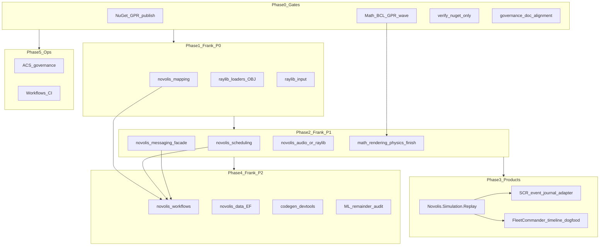

# Platform import plan

**Canonical execution plan** for migrating Frank sources and closing in-repo gaps. Detail briefs live under [`imports-todo/`](imports-todo/README.md) as appendices only — do not duplicate priority tables there.

**Last updated:** 2026-05-25

---

## Status summary

| Phase | Theme | Status |
|-------|--------|--------|
| **Done** | Replay, Tcp middleware, TwoD.Silk | **done** — GPR publish pending |
| **0** | Publish gates, Math BCL, Numerics sunset, polish | **done** (in-repo); GPR merge pending |
| **1** | Mapping, Raylib Loaders, Raylib Input | **done** (code); registry/GPR pending |
| **2** | Cron, Messaging facade, Audio, ViewPose bridge | **done** (code); dogfood samples optional |
| **3** | SCR / FC adopt Replay | **done** (platform + dogfood); product repos adopt when ready |
| **4** | Workflows, EF, codegen devtools, ML audit | **spec + audit** — implementation after Phase 1–2 GPR |
| **5** | ACS, central CI, DependenciesExplorer | **done** (governance scaffolding) |

---

## Dependency graph



---

## Global rules

- **Mine (Frank):** `D:\frankrepos`, `D:\github\Frank.*`, FleetCommander, SCR — extract **pieces** via rebuild, not wholesale copy.
- **Third-party:** `D:\repos`, `D:\dotnetrepos` — **inspiration only**; NuGet or minimal reimplementation.
- **Cross-repo:** [`nuget-only-policy.md`](nuget-only-policy.md) — `PackageReference` only; publish upstream before consumer bumps.
- **Stack:** [`library-boundaries.md`](library-boundaries.md) — Math → Physics → Simulation; Raylib/Rendering orthogonal.

Policy: [`imports-todo/third-party-inspiration-policy.md`](imports-todo/third-party-inspiration-policy.md).

---

## Already done (closed)

| Item | Evidence | Appendix |
|------|----------|----------|
| Simulation replay (FC patterns) | `novolis-simulation/src/Novolis.Simulation.Replay` | [fleetcommander-patterns](imports-todo/fleetcommander-patterns-for-platform.md) |
| TCP middleware + memory transport | `novolis-transports/src/Novolis.Transports.Tcp.Abstractions` | [bedrockframework-transports](imports-todo/bedrockframework-transports-inspiration.md) |
| 2D platformer lane | `Novolis.Rendering.TwoD` + `Backends.TwoD.Silk` | [gameengine-2d](imports-todo/gameengine-2d-scene-rendering.md) — Raylib `Scene2D` **cancelled** |

**Follow-ups:** GPR publish Replay + Tcp.Abstractions; SCR/FC product adoption of Replay.

---

## Phase 0 — Publish gates and in-repo completion

| Workstream | Status | Appendix |
|------------|--------|----------|
| GPR / local feed (Math, Replay, Tcp) | pending merge | [nuget-setup.md](nuget-setup.md) |
| Math BCL wave | done in source | [math-bcl-refactor-publish-wave](imports-todo/internal-novolis-audit/math-bcl-refactor-publish-wave.md) |
| Physics.Numerics sunset | done (package removed) | [physics-numerics-package-sunset](imports-todo/internal-novolis-audit/physics-numerics-package-sunset.md) |
| ViewBasis / slab parity / RigidTransform | done | [viewbasis](imports-todo/internal-novolis-audit/rendering-viewbasis-ray-generation.md), [ilgpu-bvh-slab-parity](imports-todo/internal-novolis-audit/ilgpu-bvh-slab-parity.md), [rigidtransform](imports-todo/internal-novolis-audit/rigidtransform-and-obsolete-transform.md) |
| Doc alignment | done | [governance-docs-stale-references](imports-todo/internal-novolis-audit/governance-docs-stale-references.md) |

**Acceptance:** `pwsh -File novolis-governance/scripts/verify-nuget-only.ps1` exit 0; consumers build on packages only after GPR.

---

## Phase 1 — Frank P0

| # | Target | Status | Source | Appendix |
|---|--------|--------|--------|----------|
| 1.1 | `novolis-mapping` | done | `Frank.Mapping` | [frank-mapping](imports-todo/frank-mapping.md) |
| 1.2 | `Novolis.Raylib.Loaders` | done | `Frank.GameEngine.Assets` OBJ | [gameengine-assets](imports-todo/gameengine-assets-mesh-import.md) |
| 1.3 | `Novolis.Raylib.Input` | done | `Frank.GameEngine.Input` (minimal) | [gameengine-input](imports-todo/gameengine-input.md) |

**Acceptance:** TUnit per repo; registry entry; dogfood mesh or input sample.

---

## Phase 2 — Frank P1

| # | Target | Status | Appendix |
|---|--------|--------|----------|
| 2.1 | `novolis-scheduling` | done (skeleton) | [frank-scheduling-cronjobs](imports-todo/frank-scheduling-cronjobs.md) |
| 2.2 | Messaging facade | done | [frank-messaging-facade](imports-todo/frank-messaging-facade.md) |
| 2.3 | `novolis-audio` | done (skeleton) | [gameengine-audio](imports-todo/gameengine-audio.md) |
| 2.4 | ViewPose → CameraSnapshot bridge | done | [simulation-viewpose-to-rendering](imports-todo/internal-novolis-audit/simulation-viewpose-to-rendering-bridge.md) |
| 2.5 | Codegen bindings backlog | deferred | [codegen-bindings-backlog](imports-todo/internal-novolis-audit/codegen-bindings-backlog.md) |

---

## Phase 3 — Product patterns

| Product | Platform work | Status |
|---------|---------------|--------|
| FleetCommander | Adopt `Novolis.Simulation.Replay` in headless tests | documented — product repo |
| Star Conflicts Revolt | Event journal stays product; Replay for tick snapshots | documented — optional `ISimulationEventStore<T>` |
| Dogfooding | `ViewPoseRenderingBridge` + Replay sample test | done |

Appendices: [fleetcommander-patterns](imports-todo/fleetcommander-patterns-for-platform.md), [star-conflicts-revolt-patterns](imports-todo/star-conflicts-revolt-patterns.md).

---

## Phase 4 — Frank P2 (after Phase 1–2 GPR)

| # | Target | Status | Depends |
|---|--------|--------|---------|
| 4.1 | `novolis-workflow-engine` | spec | Mapping + Cron + Messaging (`novolis-workflows` remains GitHub Actions shared workflows) |
| 4.2 | `novolis-data` EF facet | spec | Testing GPR |
| 4.3 | Codegen devtools facets | spec | [frank-codegen-devtools](imports-todo/frank-codegen-devtools.md) |
| 4.4 | ML remainder audit | **audit done** | [frank-ml-remainder](imports-todo/frank-ml-remainder.md) |

See [`platform-import-phase4-backlog.md`](platform-import-phase4-backlog.md).

---

## Phase 5 — Governance and CI

| # | Work | Status |
|---|------|--------|
| 5.1 | ACS alignment (`AGENTS.md`, `.ai/index.md`, verify script) | done |
| 5.2 | Central reusable workflows | done (template under `.github/workflows`) |
| 5.3 | DependenciesExplorer maintainer note | documented in [github-frank-mine-extra](imports-todo/github-frank-mine-extra.md) |

---

## Do not import

| Category | Examples |
|----------|----------|
| Frank skip list | WPF, HttpDude, TorrentClient, bulk `Frank.GameEngine` 3D (UBL/XSD → `novolis-xsd`) | [frank-repos-explicit-skip](imports-todo/frank-repos-explicit-skip.md) |
| Third-party vendoring | bullet3, ravendb, MonoGame, Unity `rebellion2` | [repos-third-party-catalog](imports-todo/repos-third-party-catalog.md) |
| dotnetrepos bulk | aspnetcore/efcore forks | [dotnetrepos-platform-reference](imports-todo/dotnetrepos-platform-reference.md) |
| Bedrock fork | Tcp slice done; logging middleware optional only | [bedrockframework-transports](imports-todo/bedrockframework-transports-inspiration.md) |

---

## Verification checklist (every phase)

1. `pwsh -File novolis-governance/scripts/verify-nuget-only.ps1` → exit 0
2. Affected solution `dotnet build` + `dotnet test`
3. Pack affected packages `2026.1.*`; bump consumer `Directory.Packages.props`
4. Update this status table + [frank-inventory.md](frank-inventory.md)

---

## Implementation order

```text
Phase0 (Math GPR, Numerics sunset, docs)
  → Phase1 (Mapping, Raylib Loaders, Raylib Input)
  → Phase2 (Cron, Messaging, Audio) ∥ Phase5 (ACS, CI)
  → Phase3 (SCR Replay adoption, FC tests)
  → Phase4 (Workflow → EF → Codegen devtools → ML audit)
```
